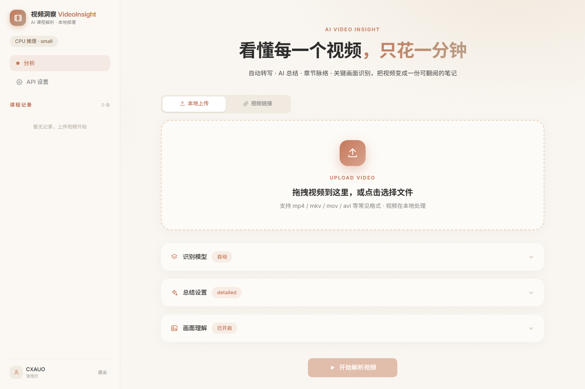
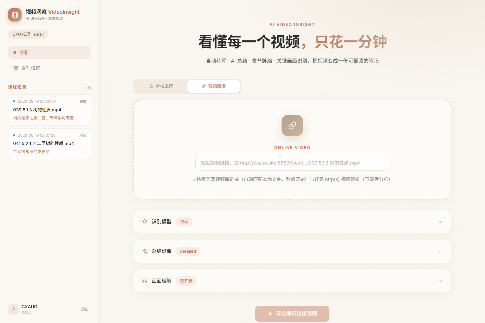
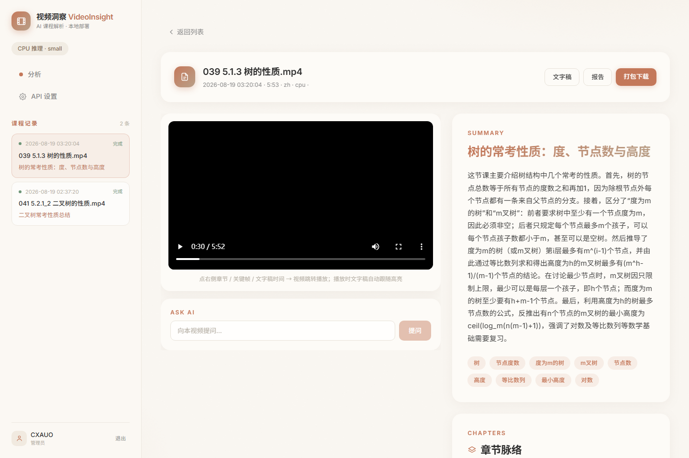
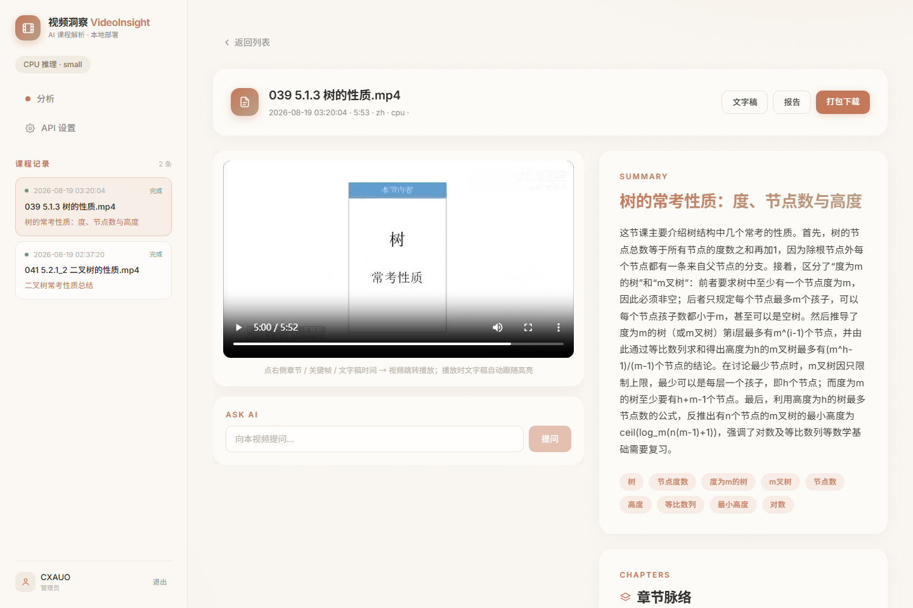
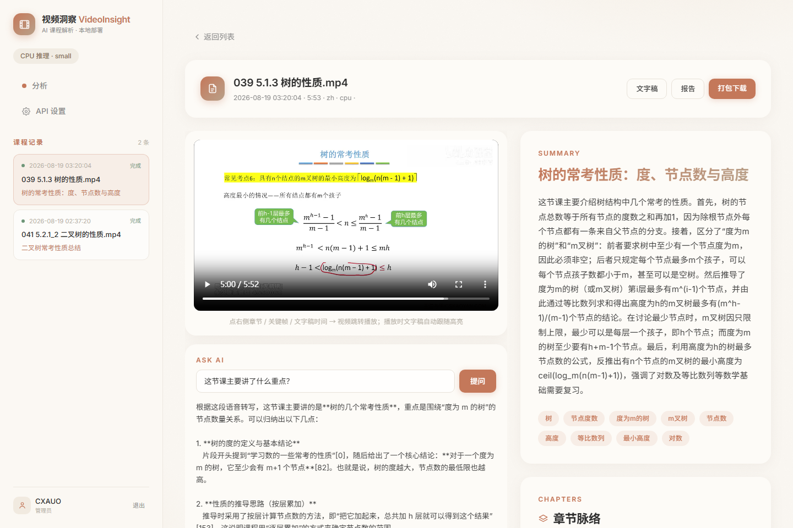

# 🎬 视频洞察 VideoInsight

AI 解析视频讲了什么 —— 上传本地视频，自动生成 **摘要 / 章节时间轴 / 关键画面理解 / 完整文字稿**。

## ✨ 功能

- 📤 **拖拽上传**本地视频（mp4 / mkv / mov / avi / flv / wmv / webm）
- 🎙 **语音转写**：faster-whisper，GPU 自动加速，CPU 也可运行（int8 量化）
- 📝 **AI 总结**：摘要 + 章节时间轴 + 要点 + 关键词，9 种总结风格
- 🖼 **画面理解**（可选）：根据字幕时间戳定位关键点 → 抽帧 → 多模态模型识别 PPT / 图表 / 代码 / 屏幕内容 → 截图配图进总结
- ⚙️ **自定义 API**：任意 OpenAI 兼容接口（DeepSeek / Grok / 中转站 / Ollama），内置预置配置（本地注入，不进仓库）
- 🔒 **隐私**：视频文件只在本机/服务器处理，仅文字稿与关键帧发送到所配置的 AI API

## 📸 界面预览

| 登录 / 注册 | 首页 · 上传与分析 |
| --- | --- |
|  |  |
| **视频链接模式** | **详情页 · 左右分栏** |
|  |  |
| **文字稿联动高亮** | **AI 问答（时间戳引用）** |
|  |  |

## 🏗 技术栈

| 层 | 技术 |
|---|---|
| 前端 | React 18 + Vite + TailwindCSS 4 + Framer Motion |
| 后端 | Python 3.11+ / FastAPI |
| 转写 | faster-whisper（CTranslate2，GPU float16 / CPU int8） |
| 大模型 | OpenAI 兼容客户端（可配置任意供应商） |
| 存储 | SQLite（任务记录）+ 本地文件 |

## 🚀 快速开始（Windows）

### 1. 后端

```bash
cd backend
python -m venv .venv
.venv\Scripts\pip install -r requirements.txt -i https://pypi.tuna.tsinghua.edu.cn/simple
# 可选：配置模型下载镜像（国内网络）
set HF_ENDPOINT=https://hf-mirror.com
.venv\Scripts\python -m uvicorn app.main:app --host 0.0.0.0 --port 8892
```

### 2. 前端

```bash
cd frontend
npm install --registry=https://registry.npmmirror.com
npm run build        # 产物输出到 dist，由后端自动托管
```

浏览器打开 http://127.0.0.1:8892 即可使用。

> 一键脚本：双击 `start.bat`（先执行一次 `setup.bat` 安装依赖）。

## ⚙️ API Key 配置

打开网页右上角 **⚙️ API 设置**：

- **内置提供商**：通过本地 `backend/data/providers.json` 注入（已被 .gitignore 排除），Key 从环境变量或 `~/.dsh/.credentials.yaml`（DSH 凭据）读取
- **自定义提供商**：填写 ID / Base URL / API Key / 模型名，勾选"支持图片输入"即可用于画面理解（如 qwen-vl / gpt-4o-mini / grok-4.6）
- 可"测试连接"验证

## 🖼 画面理解怎么工作

1. 转写得到**带时间戳**的文字稿
2. LLM 分析文字稿，定位"关键点"（话题转换、讲解 PPT、演示操作等时刻）
3. ffmpeg 按时间戳**定向抽帧**（不是逐帧，成本极低）
4. 多模态模型识别每帧画面内容（PPT / 图表 / 代码 / 字幕）
5. 画面描述与截图插入最终总结的对应章节

## 📁 目录结构

```
├── backend/            # Python FastAPI
│   ├── app/
│   │   ├── main.py     # API 入口
│   │   ├── config.py   # 提供商配置（DSH 凭据 / 环境变量 / 自定义）
│   │   ├── transcribe.py # ffmpeg 抽音频 + faster-whisper 转写
│   │   ├── llm.py      # OpenAI 兼容客户端（总结/关键点/画面描述）
│   │   ├── vision.py   # 按时间戳抽帧 + 多模态识别
│   │   ├── pipeline.py # 主流水线（CPU/GPU 自动选模型）
│   │   └── tasks.py    # SQLite 任务管理
│   └── requirements.txt
├── frontend/           # React + Vite + Tailwind
│   └── src/
└── start.bat / setup.bat
```

## 🛠 无 GPU 服务器部署

faster-whisper 基于 CTranslate2，**CPU 即可运行**（int8 量化）。无 GPU 时：

- 系统自动选择 `small` 模型（GPU 自动用 `large-v3-turbo`）
- 可在网页上传时手动选更小模型（`tiny` / `base`）提速
- 无需安装 CUDA / cuDNN，仅需 `ffmpeg`

## 📄 License

MIT
